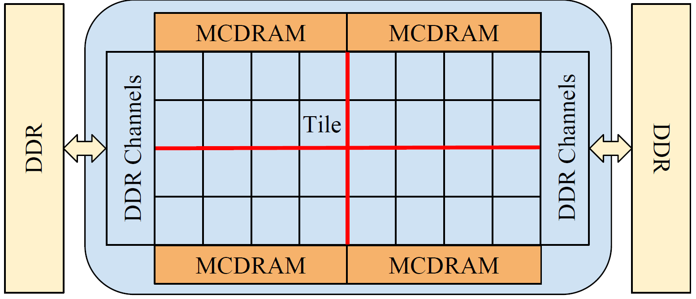
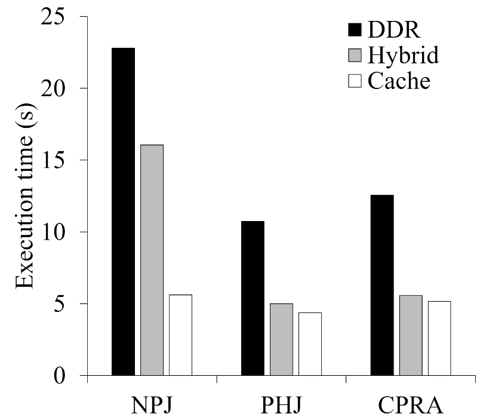

# hash_join_codes_KNL
Vectorized implementations of hash join algorithms on Intel Xeon Phi (KNL)

## Overview
Advanced processor architectures have been driving new designs, implementations and optimizations of main-memory hash join algorithms recently. The newly released Intel Xeon Phi many-core processor of the Knights Landing architecture (KNL) embraces interesting hardware features such as many low-frequency out-of-order cores connected on a 2D mesh, and high-bandwidth multi-channel memory (MCDRAM). 

In these implementations, we experimentally revisit the state-of-the-art main-memory hash join algorithms to study how the new hardware features of KNL affect the algorithmic design and tuning as well as to identify the opportunities for further performance improvement on KNL. In detail, we implement the state-of-the-art simple hash join (denoted as SHJ), partitioned hash join (with and without NUMA-aware optimizations, denoted as PHJ and CPRA, respectively).  Our experiments show that, although many existing optimizations are still valid on KNL with proper tuning, even the state-of-the-art algorithms have severely underutilized the memory bandwidth and other hardware resources. 

### Architecture of Intel Xeon Phi

The Intel Xeon Phi of the Knights Landing architecture (KNL) is illustrated in the above figure. The KNL model we use consists of 32 tiles, 16 GB MCDRAM and other hardware components which are all connected to a 2D mesh. Each tile tightly couples two low-frequency out-of-order x86-based cores, and two 512-bit Vector Processing Units (VPUs). Each core has its L1 caches and shares a 1 MB L2 cache with the other peer in the same tile. Through the memory channels, KNL connects to at most 400 GB DDR main memory. For more details, please refer to our publication listed below.

### Performance evaluation

The above figure compares the execution time of three state-of-the-art hash join algorithms when executed in the flat (where only the DDR is used), hybrid, and the cache mode. The hybrid mode helps to reduce the execution time by 29\%, 53\%, and 58\% for NPJ, PHJ, and CPRA, respectively. The cache mode further reduces the execution time by 65\%, 12\%, and 7\% for these three algorithms, respectively. Among them, PHJ performs the best. Among the three hash join algorithms, NPJ benefits a lot from the high-bandwidth MCDRAM configured as a third-level cache, and the other two have only minor performance gain. Comparing the hybrid mode and the cache mode, we find that, the larger the MCDRAM cache, the better the performance. For more results, please refer to our publication listed below.
 
## Prerequisites

### Hardware

* Intel Xeon Phi Many-core processor of the Knights Landing Architecture 
* x86-based Intel CPUs with AVX-512 support (not verified yet)

### Software

* Linux 
* Intel C/C++ 17.0.2 20170213
* The [memkind library](https://github.com/memkind/memkind)

## Build
```
make npj
make phj
make cpra
```

## Generate input relations
```
make write
./write [#threads] [size of the outer relation] [size of the input relation] 
```

## Run hash joins
```
./npj [#threads] [size of the outer relation] [size of the input relation]
./phj [#threads] [size of the outer relation] [size of the input relation]
./cpra [#threads] [size of the outer relation] [size of the input relation]
```

## Publication

* Xuntao Cheng, Bingsheng He, Xiaoli Du, and Chiew Tong Lau. 2017. [A Study of Main-Memory Hash Joins on Many-core Processor: A Case with Intel Knights Landing Architecture](https://dl.acm.org/citation.cfm?id=3132847.3132916). In Proceedings of the 2017 ACM on Conference on Information and Knowledge Management (CIKM '17). ACM, New York, NY, USA, 657-666. DOI: https://doi.org/10.1145/3132847.3132916

## Ongoing work

Based on our exisiting study, we are exploing several directions to further exploit the many-core architecture and die-stacked High Bandwidth Memory for main-memory databases. We list three major directions in the following. By far, we have explored the first two directions and submitted our research manuscripts to related conferences. 

* Optimizing hash joins algorithms taking advantage of opportunities identified in exisiting studies
* Deploying hash tables on many-core architectures with die-stacked High Bandwidth Memory
* Optimizing query processing on such hardware platforms

## Contact

Cheng Xuntao [email](xcheng002@ntu.edu.sg)
